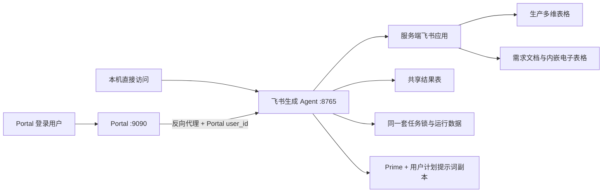

# 飞书生成 Agent 接入 Portal 与用户级计划提示词设计

**日期：** 2026-07-24
**状态：** 已确认，待实施计划
**范围：** Portal 接入、用户级计划提示词、中文规划、内嵌电子表格素材读取、多用户任务隔离

## 1. 背景与已确认问题

当前飞书生成 Agent 独立运行在 `127.0.0.1:8765`，由
`com.feishu-generation-agent` 的 launchd 服务守护。Portal 运行在
`https://192.168.30.5:9090`，已有登录账号、角色和反向代理能力。

本次生产验证暴露出两个问题：

1. “魂穿”任务的计划提示词由 DeepSeek 直接返回为英文。当前代码只校验
   JSON 和任务结构，没有校验主要规划字段的语言，因此英文结果可以进入审批。
2. “魂穿”需求文档实际包含一个飞书 Block 30 内嵌电子表格。当前文档读取器
   只处理普通图片 Block 27，最终只向规划器提供了正文中的 2 张图片，内嵌
   表格中的素材没有进入视觉理解和任务规划。

飞书只读探测已确认，内嵌电子表格 token 可以从 Block 30 取得，但当前飞书
应用缺少 Sheets 读取权限，接口返回权限错误 `99991672`。为同时覆盖直接读取
和 XLSX 导出回退，实施前开通 `sheets:spreadsheet:readonly` 与
`drive:drive:readonly`。

## 2. 目标

1. 在现有 Portal 中新增“飞书任务 Agent”页签，让其他 Portal 用户直接使用。
2. 保留当前独立 Agent 和 Prime 计划提示词，不允许 Portal 用户的修改覆盖
   本机最初版本。
3. 每个 Portal 用户拥有独立的计划提示词副本，只能查看和修改自己的副本。
4. 规划主体使用中文，原需求明确要求的英文对白、画面文字和品牌名保持原文。
5. 读取普通文档图片和内嵌电子表格图片，避免素材被静默遗漏。
6. 共用现有生产任务锁和结果表，防止不同用户重复领取同一任务。
7. 保持客户端零环境依赖；飞书 App ID、Secret 和文档权限始终留在服务端。

## 3. 非目标

- 不允许管理员查看或修改其他用户的计划提示词。
- 不为每位制作人创建独立结果表，继续使用现有共享结果表。
- 不把 Agent 前后端重写成 Portal 原生组件。
- 不让 Portal 接管或重启 Agent 进程。
- 不开放视觉理解提示词、审查提示词或供应商执行提示词的用户编辑能力。
- 不引入新的客户端构建工具或前端框架。
- 不在本次增加公网登录、外部身份提供商或跨公司租户能力。

## 4. 方案选择

采用“Portal 代理现有外部守护 Agent”的方案。

### 4.1 不采用独立第二实例

第二实例会带来两套本地任务锁、重复扫描生产表、SQLite 并发和双重领取风险。
即使两个实例使用不同数据目录，也无法天然共享当前的生产任务锁。

### 4.2 不采用 Portal 原生重写

Agent 已有完整审批界面和 LangGraph 后端。把功能重新写进 Portal 会重复前端
逻辑，并让 Portal 与 Agent 的工作流实现强耦合，不利于后续迁移。

## 5. 总体架构

### 5.1 Portal 注册

`portal/apps.json` 增加 Agent 项目，端口为 `8765`，挂载方式为 iframe。应用规格
增加 `managed: false`，默认值保持 `true`，避免影响现有四个子应用。

对 `managed: false` 的应用：

- Portal 不执行端口清理；
- Portal 不启动、杀死或自动重启进程；
- Portal 只进行健康检查和反向代理；
- Agent 进程继续由现有 launchd 服务守护；
- Portal 重启不会中止正在生成的视频。

Portal 页面新增一个固定页签和 iframe，地址为
`/feishu-generation-agent/`。Agent 前端的静态资源、API、预览图片和下载地址
必须支持该路径前缀，同时保留直接访问 `http://127.0.0.1:8765/` 的能力。

### 5.2 服务端身份

Portal 认证成功后，在代理请求中覆盖并传递：

- `X-Portal-User-Id`：Portal 中稳定且不可变的用户 ID；
- `X-Username`：显示名称；
- 现有 `X-Portal-Ts`、`X-Portal-Sig` 等 Portal 内部头保持兼容。

浏览器提交的同名身份头不得直接透传，必须由 Portal 根据登录会话重新生成。
Agent 只监听 `127.0.0.1`，局域网客户端无法绕过 Portal 直连后端。

请求没有 `X-Portal-User-Id` 时视为本机 Prime 模式。Prime 模式不显示个人提示词
设置入口，并继续使用最初的 Prime 计划提示词。

## 6. Prime 与用户计划提示词

### 6.1 两层提示词

Portal 模式下，发给 DeepSeek 的计划系统消息由两层组成：

1. **不可编辑执行契约**
   - JSON Schema 和只返回 JSON；
   - 允许的任务类型；
   - Seedance 首尾帧与多参考规则；
   - 素材覆盖规则；
   - 中文规划规则；
   - 不得虚构素材；
   - 供应商参数和付费任务数量约束。
2. **用户可编辑计划提示词**
   - 需求理解偏好；
   - 风格和叙事侧重点；
   - 素材选择偏好；
   - 用户希望长期复用的规划要求。

用户提示词不能覆盖不可编辑执行契约。两层有冲突时，以执行契约为准。

### 6.2 Prime 不变性

现有计划提示词内容作为 Prime 基线保存，内容按原始版本逐字保留。本机 Prime
模式仍直接使用该基线，不读取 Portal 用户配置。

增加回归测试固定 Prime 文本，防止后续功能开发意外修改基线。Portal 用户点击
“恢复 Prime”时，只删除自己的覆盖值，重新继承 Prime，不写回 Prime 本身。

### 6.3 用户配置存储

在 Agent 的业务数据库中增加用户计划提示词表，最少包含：

- `portal_user_id`，主键；
- `username`，仅用于显示；
- `prompt_text`；
- `version`，每次保存递增；
- `created_at`；
- `updated_at`。

Prime 不写入该表。没有记录表示该用户正在继承 Prime。

API 只允许操作当前 Portal 用户：

- `GET /api/planner-prompt`：返回 Prime、个人副本、当前有效状态和版本；
- `PUT /api/planner-prompt`：保存当前用户的个人副本；
- `DELETE /api/planner-prompt`：恢复 Prime。

没有 Portal 用户身份的直接访问只能读取“Prime 模式”状态，不能创建覆盖值。

### 6.4 运行快照

用户领取任务时，把以下内容固化进本次运行状态：

- `portal_user_id`；
- 当前有效计划提示词；
- 提示词版本；
- Prime 或个人副本的来源标记。

运行开始后，用户再修改个人提示词只影响新任务。当前运行中的重新规划继续使用
原快照，保证结果可复现。重跑已批准计划沿用原任务计划，不重新读取最新提示词。

## 7. 中文规划

不可编辑执行契约要求以下字段以中文为主体：

- `document_summary`；
- `user_intent`；
- `prompt`；
- `negative_constraints`；
- `assumptions`；
- `warnings`；
- 素材排除原因。

英文对白、品牌名、界面文字和需求明确指定的外语内容可以保留，但提示词中的
镜头、动作、构图和执行说明必须有中文。

结构化输出校验增加语言检查：

- `document_summary`、`user_intent` 和 `prompt` 至少包含中文字符；
- 没有中文时进入现有结构修复循环；
- 修复指令明确要求只修复语言与已报告字段，不重新发明需求；
- 三次仍不合格时停止在付费执行前，向用户显示计划语言校验失败。

系统不会在审批后把中文提示词静默翻译为英文；提交给生成供应商的主体提示词
与审批页面保持一致。

## 8. 内嵌电子表格素材读取

### 8.1 Block 30 识别

文档读取器增加 Block 30 `sheet` 类型。从 Block 中取得 spreadsheet token，
保留它在文档层级和文本顺序中的位置。

### 8.2 读取顺序

1. 使用 Sheets API 查询工作表元数据和有效范围；
2. 读取单元格文字、公式展示值和可直接获得的图片信息；
3. 下载图片并转换为现有 `MediaAsset`；
4. 如果 Sheets API 没有暴露嵌入图片，则通过飞书导出接口导出 XLSX；
5. 使用 ZIP/XML 读取 XLSX 中的图片、工作表关系和锚点，不新增客户端依赖；
6. 将提取结果按工作表、行列锚点和文档顺序插回 `text_view`。

图片使用内容哈希去重，但同一图片在不同位置出现时保留来源位置。素材标识必须
稳定，至少包含文档、工作表、锚点或顺序和内容哈希，避免重新读取后图片编号
无意义漂移。

### 8.3 失败策略

- 没有 Sheets 权限：标记为阻断性读取问题，不继续生成一个看似完整的计划；
- 某个工作表读取失败：显示工作表名称或 ID 和失败原因；
- 单张图片下载失败：其余图片继续进入视觉理解，但审批页必须展示缺失素材；
- 直接 API 与 XLSX 回退都失败：不允许静默忽略整个内嵌表格。

## 9. 素材覆盖

任务计划增加显式素材处置结果。每张成功读取的图片必须满足以下之一：

1. 被至少一个生成任务的 `reference_images` 引用；
2. 位于 `excluded_assets`，并具有中文排除原因。

校验规则：

- 引用和排除集合的并集必须覆盖全部成功读取的图片；
- 同一图片不能同时被引用和排除；
- 不允许引用不存在或下载失败的图片；
- 默认尽量使用所有与需求相关的图片；
- 超过供应商素材数量限制时才允许筛选，并明确说明限制和选择理由。

审批界面显示：

- “已使用 X / 共 Y 张”；
- 每个任务正在使用的参考图片；
- 未使用图片缩略图和中文原因；
- Sheets 或下载失败造成的缺失数量；
- 现有添加、替换、删除参考图片能力继续保留。

用户手动添加图片后，系统从排除集合移除该图片。用户手动移除图片后，系统生成
“用户在审批中移除”的排除记录，保证批准前素材处置仍然完整可见。

## 10. 多用户任务隔离

### 10.1 公共内容

所有 Portal 用户共同看到尚未领取、符合扫描条件的生产任务。所有用户通过同一个
服务端飞书应用读取生产表、需求文档和附件，不需要客户端飞书授权。

### 10.2 私有内容

运行记录增加 `portal_user_id`：

- 领取任务时写入当前用户；
- 当前运行、待审批和最近运行只返回当前用户的数据；
- 获取、审批、取消、删除、重跑、修改参考图等运行 API 都校验所有权；
- 访问其他用户的运行 ID 返回 404，避免泄露其存在。

现有历史运行迁移为 `prime-local` 所有，只在本机 Prime 模式可见，不出现在任何
Portal 用户列表中。

### 10.3 共享锁与结果

所有用户仍使用同一个 Agent 进程、生产任务数据库和任务锁。用户领取后，该记录
从其他用户的可领取列表中消失。任务结束、取消或超时后按现有规则释放。

产物继续写入现有共享飞书结果表。结果表结构和生产表前列复制规则不变。

## 11. 前端设计

Agent 顶部增加“计划提示词设置”入口，仅在 Portal 身份有效时显示。设置面板
包含：

- 当前状态：“使用 Prime”或“使用个人版本 vN”；
- 以 Prime 为初始内容的多行文本框；
- “保存个人版本”按钮；
- “恢复 Prime”按钮；
- 保存中、保存成功和失败反馈；
- 提示“修改只影响之后领取的新任务”。

不提供提示词历史版本列表、共享模板、管理员批量配置或跨用户复制，控制首版范围。

前端 API 地址统一通过当前挂载前缀计算。直接访问使用 `/api/...`，Portal iframe
使用 `/feishu-generation-agent/api/...`。静态资源和预览图片采用同一规则。

## 12. 安全与凭证

- 飞书 App ID、Secret、Sheets 权限、DeepSeek Key 和生成供应商 Key 全部留在
  服务机后端；
- 浏览器只持有 Portal 的 HttpOnly 登录 Cookie，不接触飞书 tenant token；
- Portal 必须覆盖身份头，不能信任浏览器自报的用户 ID；
- Agent 保持绑定 `127.0.0.1`；
- 提示词 API 不返回其他用户记录；
- 日志可以记录用户 ID、提示词版本和哈希，不记录完整提示词及任何密钥。

## 13. 错误处理

- Agent 不可用：Portal 页签显示服务不可用，不重启或杀死外部进程；
- 用户提示词为空或只含空白：拒绝保存；
- 用户提示词过长：服务端按配置上限拒绝，首版上限为 20,000 个 Unicode 字符；
- 计划结构或中文校验连续失败：停在付费执行前；
- Sheets 权限缺失：显示可执行的权限说明，不返回“成功但只有两张图”的计划；
- 用户会话失效：Portal 返回 401，Agent 不接受匿名 Portal 操作；
- 运行所有权不匹配：返回 404；
- Portal 重启：外部 Agent 和正在运行的任务不受影响。

## 14. 数据迁移与兼容

- Portal 应用规格的 `managed` 默认 `true`，现有应用行为不变；
- Agent 数据库迁移采用可重复执行的增量迁移；
- 现有历史运行归属 `prime-local`；
- Prime 提示词文本保持原内容，并由回归测试固定；
- 直接访问 `8765` 的现有任务扫描、审批和执行流程保持可用；
- 未开通 Sheets 权限前，普通无 Block 30 的文档仍可工作；含 Block 30 的文档明确
  阻断并提示权限缺失。

## 15. 测试与上线验收

### 15.1 自动测试

1. Portal `managed: false` 不启动、不清理、不杀死端口进程；
2. Portal 正确代理 Agent 根页面、静态资源、API、预览和下载；
3. Portal 覆盖用户身份头；
4. 用户 A、B 的提示词保存、读取和恢复互不影响；
5. 本机无 Portal 身份时始终使用 Prime；
6. Prime 文本回归测试；
7. 运行创建时固化提示词版本；
8. 主要规划字段无中文时触发修复；
9. 英文对白在中文主体提示词中得到保留；
10. Block 30 识别、Sheets 直接读取和 XLSX 回退；
11. 所有素材必须被引用或明确排除；
12. 用户只能读取和操作自己的运行；
13. 所有用户共享同一生产任务锁；
14. 现有 Agent、Portal 和其他子应用测试无回归。

### 15.2 上线顺序

1. 开通 `sheets:spreadsheet:readonly` 与 `drive:drive:readonly`；
2. 在测试 Portal 和测试端口验证代理、前缀路径及身份头；
3. 用两个 Portal 测试账号验证提示词和运行隔离；
4. 直接访问 `8765`，确认仍为 Prime 模式；
5. 重读“魂穿”需求，核对普通图片、内嵌表格图片总数和素材覆盖统计；
6. 完整执行一个测试任务并确认结果写入共享结果表；
7. 确认当前没有运行中任务后重启一次 Agent，使后端代码生效；
8. 更新 Portal 配置并重启 Portal；
9. 从另一台局域网电脑登录 `https://192.168.30.5:9090`，完成扫描、领取、
   审批和查看结果的最终验收。

## 16. 验收标准

- Portal 中可进入飞书任务 Agent，其他已登录用户可以正常使用；
- 用户 A 的计划提示词修改不影响用户 B，也不影响本机 Prime；
- 本机 Prime 文本与实施前保持一致；
- “魂穿”文档的内嵌电子表格图片被读取并显示素材覆盖状态；
- 规划主体为中文，英文对白按原需求保留；
- 所有成功读取的图片都有“已使用”或“明确排除”结果；
- 两个用户不能重复领取同一生产任务；
- 用户不能查看或操作其他用户的运行；
- Portal 重启不会中止 Agent 正在执行的任务；
- 结果继续写入现有共享飞书结果表。
